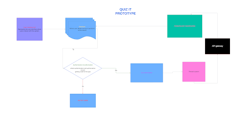
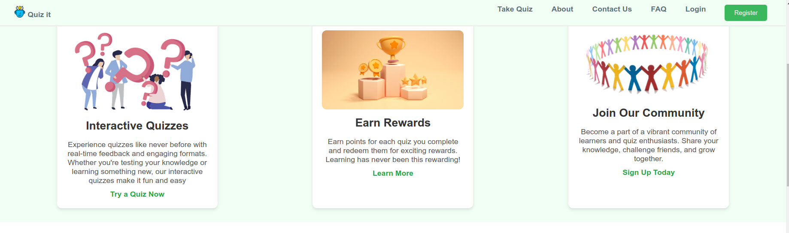
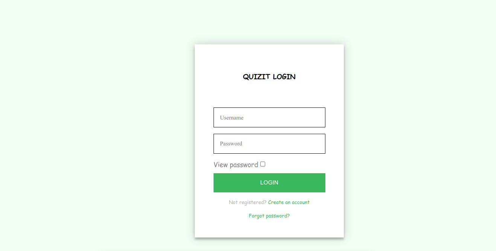
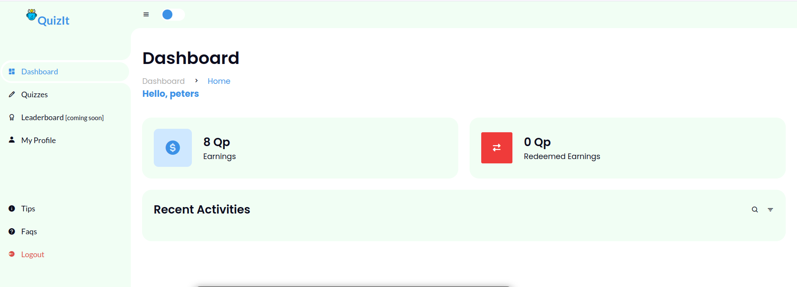

# Quiz It

**Tagline:** Quiz and Earn

**Project Description:**
Quiz It is an interactive quiz platform that allows users to take and earn rewards from quizzes on a wide range of topics. The platform aims to provide an engaging way for users to test their knowledge, compete with others, and earn rewards for their performance.

## Features

- **Take Quizzes:** Users can take quizzes, receive instant feedback on their performance, and see their scores.
- **Earn Rewards:** Users earn reward points based on their quiz performance, which can be redeemed for virtual goods.
- **Leaderboard:** Users can view leaderboards to see how their scores compare with others.

## Architecture

### Components
1. **Frontend**
   - User Interface for creating, taking quizzes, viewing leaderboards, and earning rewards.
2. **Backend**
   - REST API for handling quiz data, user authentication, reward points, and leaderboards.
3. **Database**
   - Stores user data, quizzes, questions, answers, scores, and reward points.
4. **Authentication Service**
   - Manages user login and registration.



## API Endpoints

### Quiz Management
- **GET /api/quizzes**: Retrieve a list of all available quizzes.
- **GET /api/quizzes/{quizId}**: Retrieve details of a specific quiz.

### Quiz Participation
- **POST /api/quizzes/{quizId}/submit**: Submit answers for a quiz.
- **GET /api/quizzes/{quizId}/leaderboard**: Retrieve the leaderboard for a quiz.

### Reward System
- **GET /api/rewards**: Retrieve reward points for the user.
- **POST /api/rewards/redeem**: Redeem reward points.

### User Authentication
- **POST /api/auth/register**: Register a new user.
- **POST /api/auth/login**: Authenticate a user.

## Getting Started

### Prerequisites
- HTML
- CSS
- PHP
- JavaScript
- MySQL

### Installation

1. **Clone the repository**:
   ```bash
   git clone https://github.com/codeAKstan/quiz_it-project.git
   cd quiz-it


### Run the server:

Use a local server like XAMPP or WAMP to host the PHP files.
Access the application:

Open your browser and navigate to 
```
http://localhost/quiz-it
```

## SCREENSHOTS




### Authors
Obumneme Anigbo - Full Stack Developer -[LinkedIn](https://www.linkedin.com/in/codeakstan/)

### License
This project is licensed under the MIT License - see the LICENSE file for details.